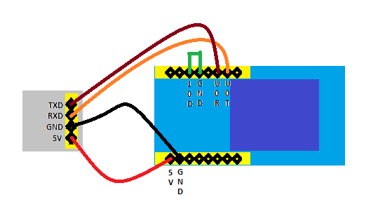

# ESPhome-Ai-Thinker

Flashing
Requirements
To flash esp32 cam you need a USB to TTL dongle.

# Wiring
- VCC -> 5v
- GND -> GND
- RXD -> UOT
- TXD -> UOR

# Instruction
## When flashing:
    - with the camera\TTL dongle unpluged
    - short the reset button (GPIO0 to GND)
    - I plugged in my board direct it my Hassio and used ESPhome Flasher to upload to board

# You can also download ESPhome Flasher to use on Windows or MAC link https://github.com/esphome/esphome-flasher/releases
